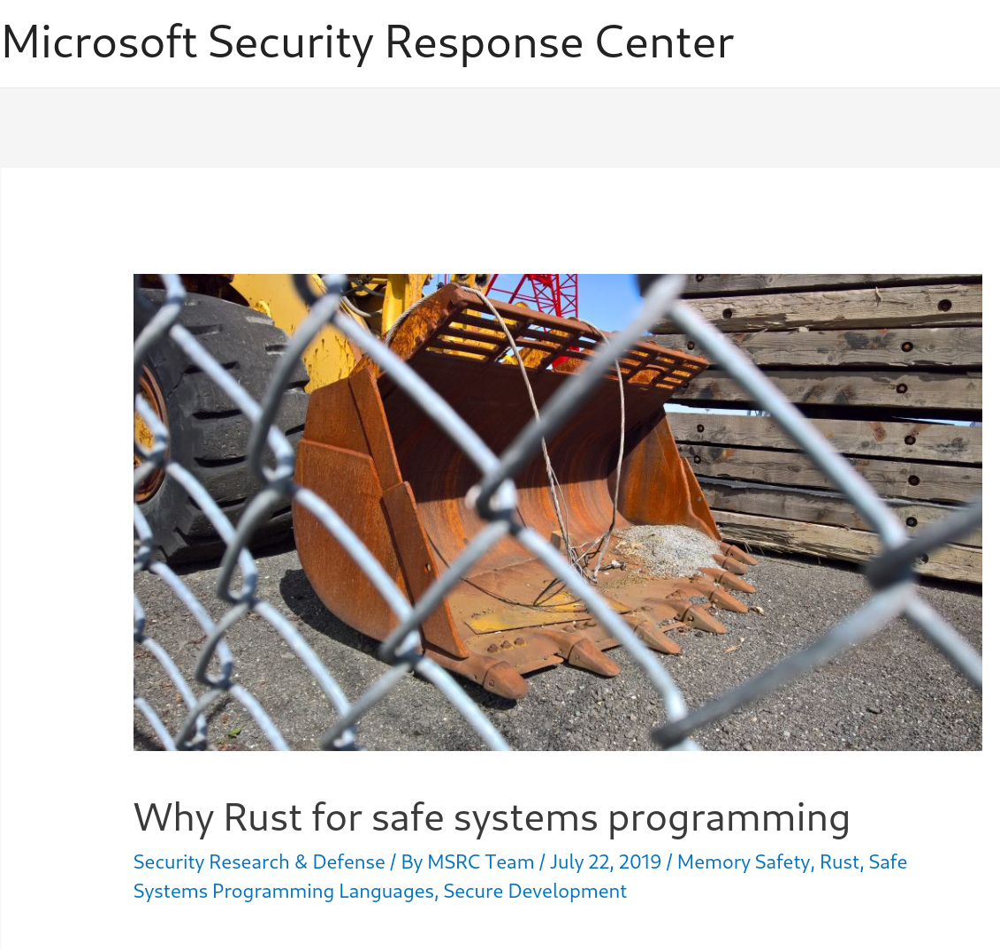

# Rust for beginners

---
Zeeshan Ali Khan

---

## 🇵🇰 🇫🇮 🇬🇧 🇸🇪 🇩🇪

---
C, GStreamer, GNOME, Maemo, Open Source

---

## 🛨  🚁  🐈

---
What is Rust? 🦀

---
Safety + Efficiency

---
Safe languages

---
Haskell, OCaml, Elang etc

---
Efficient languages

---
C/C++

---
Isn't modern C++ safe?

---
Are you a human?

---
C++ is not safe

---

---
70% of the security issues

---
