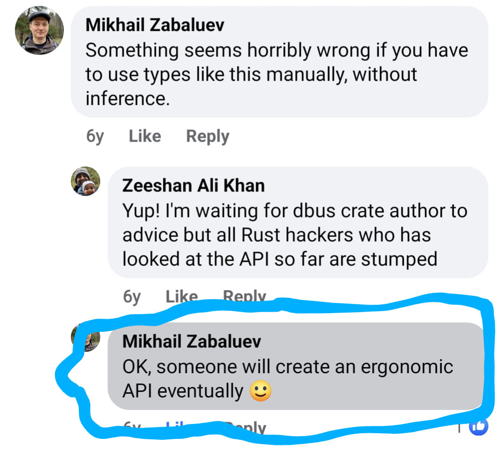

# 

## busd

There is a new D-Bus broker in town

---
Zeeshan Ali Khan

---

## 🇵🇰 🇫🇮 🇬🇧 🇸🇪 🇩🇪

---
<style scoped> section { text-align: left; } </style>

* C
* GStreamer
* GNOME
* Maemo
* Open Source

---
Now a Rust fanboy

---
JUCR

🚙⌁

---
The story begins in 2019..

---
Geoclue

---
Geolocation D-Bus service

---
Written in C

---
Tired of crash reports

---
Oxidizing

---
What's D-Bus? 🤔

---
Effecient binary IPC protocol

---
Desktop & embedded

---
systemd, GNOME & KDE etc

---
More than just IPC

---
API

---
Low-level: Message passing

---
High-level

---
<style scoped> section{ text-align: left; }</style>
Objects

```
/org/freedesktop/GeoClue2/Manager
/org/freedesktop/GeoClue2/Client
/org/freedesktop/GeoClue2/Location/0
/org/freedesktop/GeoClue2/Location/1
...
```

---
<style scoped> section{ text-align: left; }</style>
Interfaces

```
org.freedesktop.GeoClue2.Manager
org.freedesktop.GeoClue2.Client
org.freedesktop.GeoClue2.Location
...
```

---
<style scoped> section{ text-align: left; }</style>
Methods

```
org.freedesktop.GeoClue2.Manager.GetClient(OUT o client)
org.freedesktop.GeoClue2.Client.Start()
org.freedesktop.GeoClue2.Client.Stop()
```

---
<style scoped> section{ text-align: left; }</style>
Properties

```
org.freedesktop.GeoClue2.Location.Latitude
org.freedesktop.GeoClue2.Location.Longitude
org.freedesktop.GeoClue2.Location.Altitude
```

---
<style scoped> section{ text-align: left; }</style>
Signals

```
org.freedesktop.GeoClue2.Client.LocationUpdated(o old, o new)
```

---
The Broker

---
AKA D-Bus daemon

---
Or simply..

---
The Bus

---
System & Session

---
peer-to-peer (p2p)

---
How do I D-Bus in Rust?

---
There must be a crate for it!

---
dbus-rs

---
libdbus wrapper 🙄

---
Multiple issues

---
API over-complicated

---


---


---
D-Bus crate from scratch?? 😯

---
Several ☾ later

---
zbus

---
D-Bus made easy

---
🙏 Marc-André Lureau 🙏

---


---
What's with the "z"?

---
Async first

---
Blocking wrappers

---
Service

---
<style scoped> section{ text-align: left; }</style>

```rust
use zbus::{ConnectionBuilder, dbus_interface};

struct Greeter { count: u64 }

#[dbus_interface(name = "org.zbus.MyGreeter1")]
impl Greeter {
    async fn say_hello(&mut self, name: &str) -> String {
        self.count += 1;
        format!("Hello {}! I have been called {} times.", name, self.count)
    }
}

let greeter = Greeter { count: 0 };
let _conn = ConnectionBuilder::session()?
    .name("org.zbus.MyGreeter")?
    .serve_at("/org/zbus/MyGreeter", greeter)?
    .build()
    .await?;
//..
```

---
Client

---
<style scoped> section{ text-align: left; }</style>

```rust
use zbus::{Connection, Result, dbus_proxy};

#[dbus_proxy(
    interface = "org.zbus.MyGreeter1",
    default_service = "org.zbus.MyGreeter",
    default_path = "/org/zbus/MyGreeter"
)]
trait MyGreeter {
    async fn say_hello(&self, name: &str) -> Result<String>;
}

let connection = Connection::session().await?;
// `dbus_proxy` macro creates `MyGreaterProxy` based on `Notifications` trait.
let proxy = MyGreeterProxy::new(&connection).await?;
let reply = proxy.say_hello("Maria").await?;
println!("{reply}");
```

---
Goto D-Bus crate

---
World conquered?

---
Not exactly

---
What about the broker?

---
Two Implementations

---
dbus-daemon

---
dbus-broker

---
C

---
Really an issue?

---
Yes and No

---
Safety

---
Not actively developed

---
Hard to be excited

---
New contributors

---
Modern requirements

---
Sandboxing

---
xdg-dbus-proxy 😥

---
New D-Bus broker?

---
Let's first experiment

---
After 2 weekends

---
Basic impl done 😎

---
busd was born! 🥳

---
Why not oxidize dbus-daemon?

---
First Principles Thinking

---
Working around C

---
Performance

---

| Broker      | Single connection  | 20 connections |
|-------------|--------------------|----------------|
| dbus-broker |      0.417053s     |    6.757665    |
| dbus-daemon |      0.439600s     |    6.491848s   |
| busd        |      0.433934s     |    6.666954s   |

---
There must be a catch!

---
zbus doing the heavy lifting

---
Per-connection Queues

---
tokio

---
Per-connection Tasks

---
Thread Pools

---
Current status: MVP

---
Standard API

---
Windows, MacOS & Linux

---
Future goals

---
Feature Parity

---
Stress Testing

---
Policy

---
Security

---
Performance Tuning

---
Starting with zbus

---
Already done 😎

---
Up to 94% improvement

---
Sandboxed Apps

---
Slow Progress 😥

---
Doing it alone

---
STF Application Rejected 😿

---
Part of my new job?

---


---


---

## Questions?

https://github.com/dbus2/
