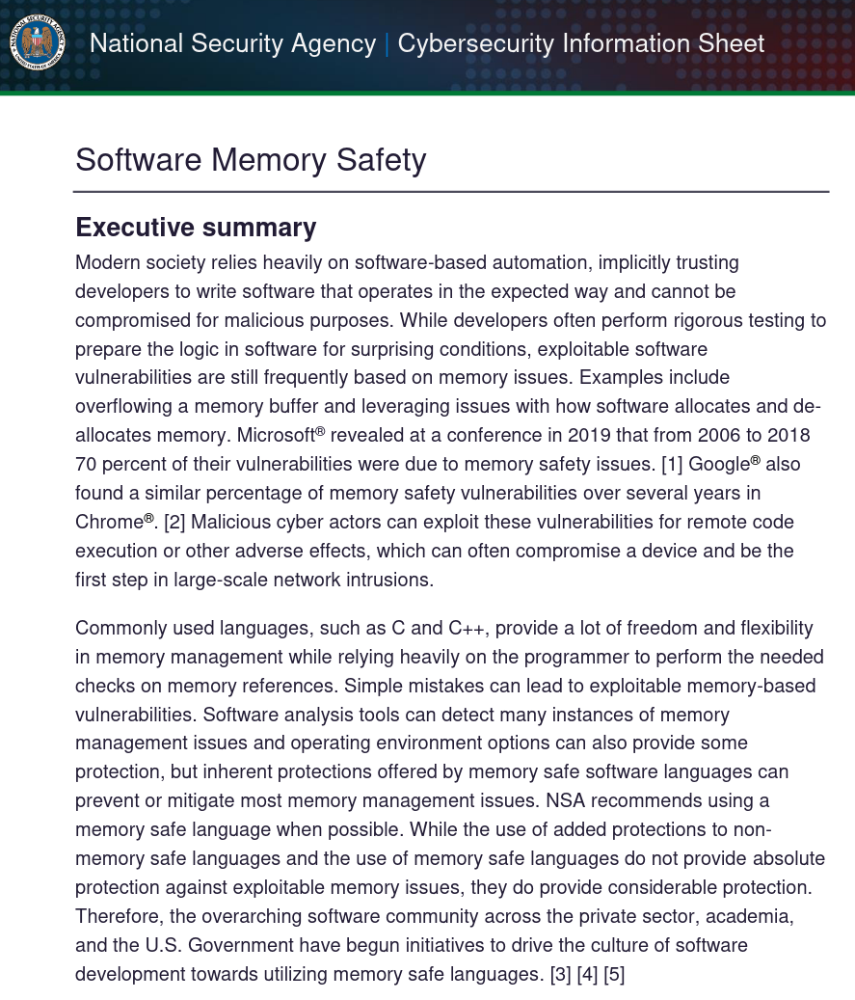

# D-Bus Oxidized

---
Zeeshan Ali Khan

---

## 🇵🇰 🇫🇮 🇬🇧 🇸🇪 🇩🇪

---
<style scoped> section { text-align: left; } </style>

* C
* GStreamer
* GNOME
* Maemo
* Open Source

---
Now a Rust fanboy

---
The story begins in 2019..

---
GNOME Rust Hackfest

---
Oxidizing Geoclue

---
What's Geoclue?

---
And what's "oxidizing"?

---
Let's take a step back

---
Geoclue

---
Geolocation D-Bus service

---
Written in C

---
What's D-Bus? 🤔

---
Effecient binary IPC protocol

---
Desktop & embedded

---
systemd, GNOME & KDE etc

---
More than just IPC

---
API

---
Low-level: Message passing

---
High-level

---
<style scoped> section{ text-align: left; }</style>
Objects

```
/org/freedesktop/GeoClue2/Manager
/org/freedesktop/GeoClue2/Client
/org/freedesktop/GeoClue2/Location/0
/org/freedesktop/GeoClue2/Location/1
...
```

---
<style scoped> section{ text-align: left; }</style>
Interfaces

```
org.freedesktop.GeoClue2.Manager
org.freedesktop.GeoClue2.Client
org.freedesktop.GeoClue2.Location
...
```

---
<style scoped> section{ text-align: left; }</style>
Methods

```
org.freedesktop.GeoClue2.Manager.GetClient(OUT o client)
org.freedesktop.GeoClue2.Client.Start()
org.freedesktop.GeoClue2.Client.Stop()
```

---
<style scoped> section{ text-align: left; }</style>
Properties

```
org.freedesktop.GeoClue2.Location.Latitude
org.freedesktop.GeoClue2.Location.Longitude
org.freedesktop.GeoClue2.Location.Altitude
```

---
<style scoped> section{ text-align: left; }</style>
Signals

```
org.freedesktop.GeoClue2.Client.LocationUpdated(o old, o new)
```

---
And "oxidizing"?

---
Port to Rust

---
But why?

---
What's so special about Rust?

---
Systems Programming

---
Safe 🤝🏽 Efficient

---


---
70% of the security issues

---


---
Tired of crashe reports

---
Beyond memory safety

---
Fearless Concurrency

---
Modern language

---
OK, OK, can we got on with it?

---
Back to the story

---
How do I D-Bus?

---
There must be a crate for it!

---
dbus-rs

---
libdbus 🙄

---
Multiple issues

---
No CI

---
Still C underneath

---
API over-complicated

---


---


---
D-Bus crate from scratch?? 😯

---
How hard can it be? 😂

---
Next several months

---
Hard at work 🧑🏽‍🏭

---
Bottom's up

---
zvariant

---
Wire protocol

---
GVariant

---
Learning Rust the hard way

---
Fun w/ D-Bus spec

---
zvariant 1.0

---
Broken 😥

---
Another several months

---
zvariant 2.0 🎉

---
<style scoped> section{ text-align: left; }</style>

```rust
use zvariant::{from_slice, to_bytes, EncodingContext};

// All (de)serialization API needs a context.
let ctxt = EncodingContext::<byteorder::LE>::new_dbus(0);

let t = ("hello", 42, true);
let encoded = to_bytes(ctxt, &t).unwrap();
let decoded: (&str, i32, bool) =
    from_slice(&encoded, ctxt).unwrap();
assert_eq!(decoded, t);
```

---
Back to D-Bus

---
Several moons later

---
zbus 1.0 🎉

---
🙏 Marc-André Lureau 🙏

---
What's with the "z"?

---
Blocking

---
Some async API

---
Didn't quite fit in

---
Another year of hard work

---
No stardard async runtime

---
zbus 2.0 🎉

---
🙏 Daniel De Graaf 🙏

---
Async first

---
Blocking wrappers

---
Service

---
<style scoped> section{ text-align: left; }</style>

```rust
use zbus::{ConnectionBuilder, dbus_interface};

struct Greeter { count: u64 }

#[dbus_interface(name = "org.zbus.MyGreeter1")]
impl Greeter {
    async fn say_hello(&mut self, name: &str) -> String {
        self.count += 1;
        format!("Hello {}! I have been called {} times.", name, self.count)
    }
}

let greeter = Greeter { count: 0 };
let _conn = ConnectionBuilder::session()?
    .name("org.zbus.MyGreeter")?
    .serve_at("/org/zbus/MyGreeter", greeter)?
    .build()
    .await?;
//..
```

---
Client

---
<style scoped> section{ text-align: left; }</style>

```rust
use zbus::{Connection, Result, dbus_proxy};

#[dbus_proxy(
    interface = "org.zbus.MyGreeter1",
    default_service = "org.zbus.MyGreeter",
    default_path = "/org/zbus/MyGreeter"
)]
trait MyGreeter {
    async fn say_hello(&self, name: &str) -> Result<String>;
}

let connection = Connection::session().await?;
// `dbus_proxy` macro creates `MyGreaterProxy` based on `Notifications` trait.
let proxy = MyGreeterProxy::new(&connection).await?;
let reply = proxy.say_hello("Maria").await?;
println!("{reply}");
```

---
Goto D-Bus crate

---
World conquered?

---
Not exactly

---
The Broker

---
AKA D-Bus daemon

---
The Bus

---
Written in C

---
CVEs over the years

---
Remote discouraged

---
Let's also oxidize that?

---
Let's first experiment

---
After 2 weekends

---
Basic impl done

---
zbus doing the heavy lifting

---
Windows, MacOS & Linux

---
dbuz -> buskin

---
Long way to go still

---
Short term goals

---
MVP

---
Standard API

---
Future goals

---
D-Bus 2.0

---
GVariant

---
Remote transport

---
# ☕
