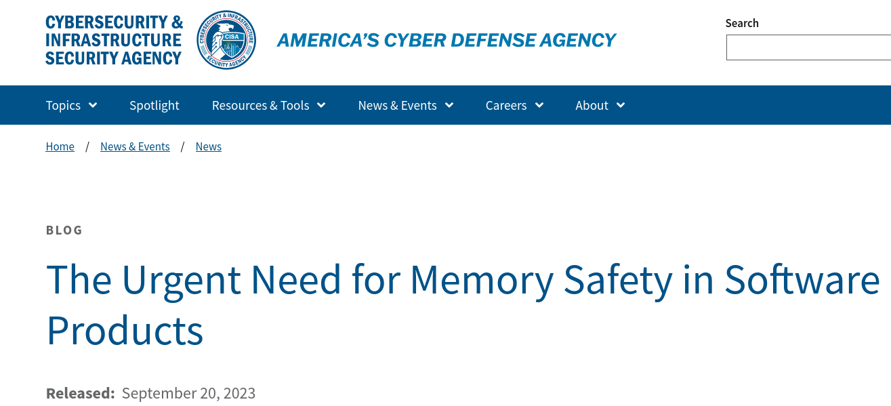

# Why you need me?

---
Zeeshan Ali Khan

---

## 🇵🇰 🇫🇮 🇬🇧 🇸🇪 🇩🇪

---
More than 2 decades of FOSS

---

* C
* GStreamer
* GNOME
* Maemo

---
And more recently

---
Rust

---
zbus

---
D-Bus

---
busd

---
Mercedes-Benz Vans

---
Digital Upfitter Platform

---
Domain Architect

---
Rust already used in production

---
Let's talk about Rust 🦀

---
Systems Programming

---
Safe + Efficient

---
Revolutionary combo

---

---

---
70% of security issues

---

* Microsoft
* Google
* Mozilla
* Facebook
* AWS
* Dropbox
* ...

---
Safety in Automotive

---
Ferrocene

---
ASIL-D

---
High Yield, Low Risk

---
Rust ADR

---
Why not Go?

---
Good fit of Automotive?

---
❌ Deterministic Performance

---
Controlled by Google

---
Go ADR

---
FOSS at Mercedes-Benz

---
Guidelines, Processes & Education

---
Our Contributions?

---
How can I help?

---
Rust + FOSS

---
busd

---
Critical System Component

---
Rust in Roadkit

---
Presentation at FOSS Conferences

---
Practical FOSS Advice

---
Questions?

